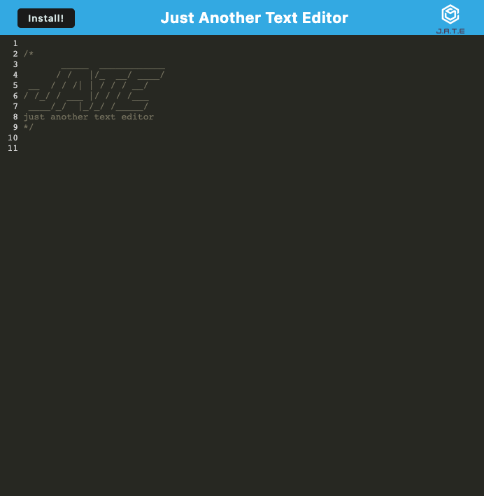

# Text Editor

[](https://opensource.org/licenses/MIT)


## Description

Just another text editor. Install as a progressive web app or use in a browser. Data stored on the indexedDB browser storage.

[Github repository](https://github.com/bradbrad88/text-editor)

[Live application](https://brad-teague-text-editor.herokuapp.com/)



## Table of Contents

- [Installation](#installation)
- [Usage](#usage)
- [License](#license)
- [Questions](#questions)

## Installation

To install necessary dependencies, run the following command:

```bash
npm run install
```

## Usage

To start the application use:

```bash
npm start
```

## License

Project license: [MIT](https://opensource.org/licenses/MIT). Copyright Brad Teague 2022

## Questions

For any questions about the project, please raise an issue at [this issues page](https://github.com/bradbrad88/text-editor/issues).

For any further questions you can contact me [here](b_rad88@live.com).
